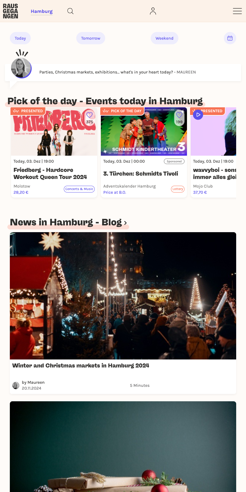
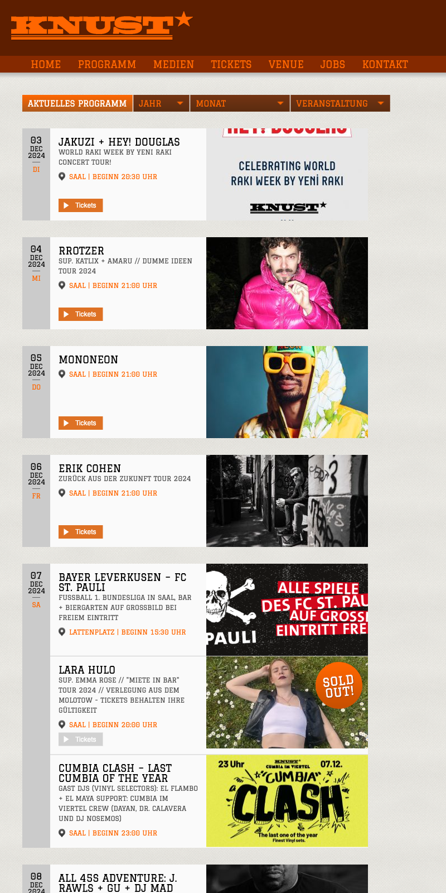
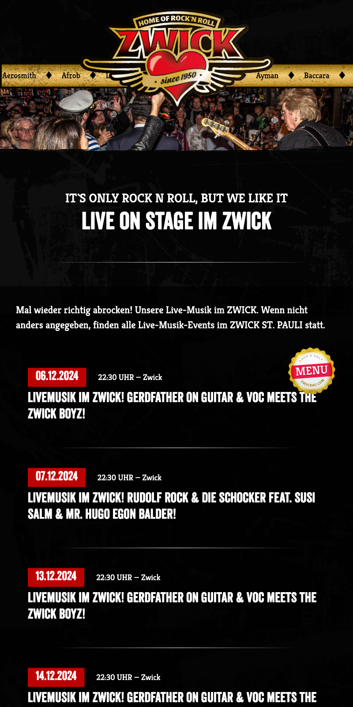
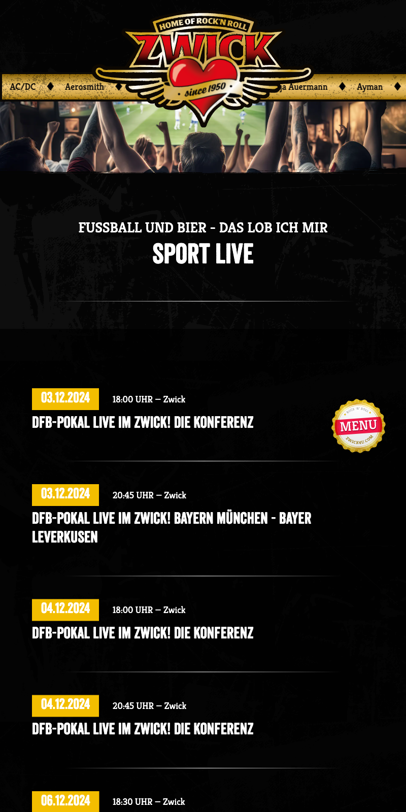
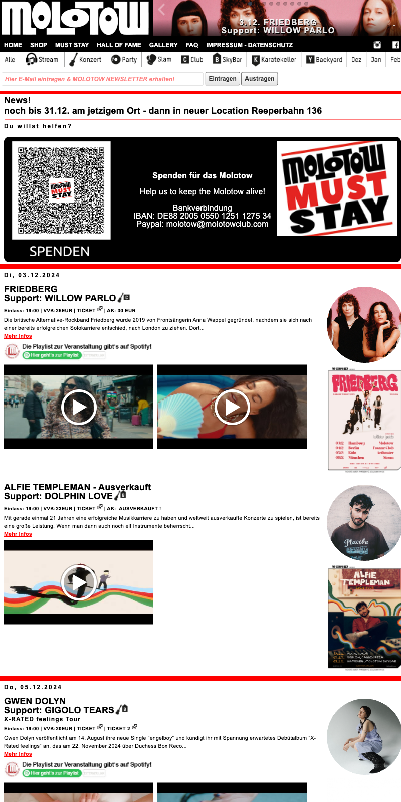
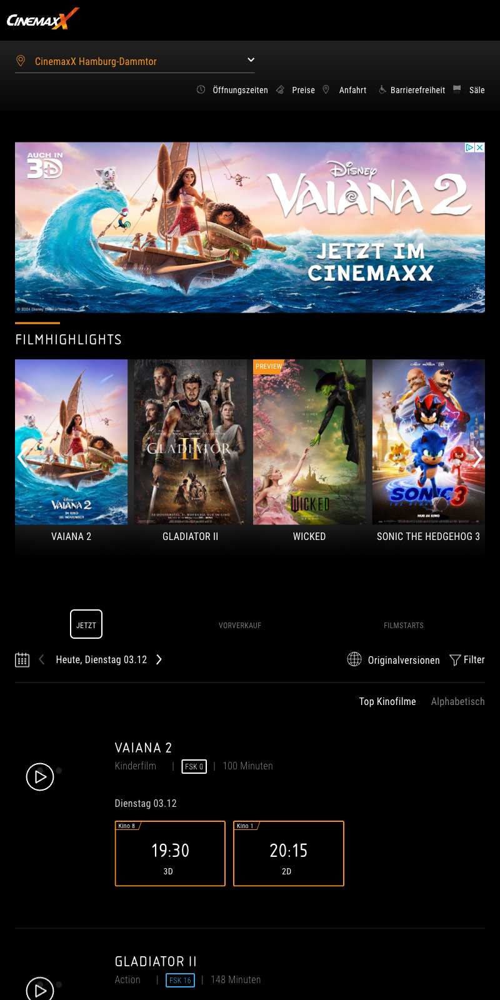
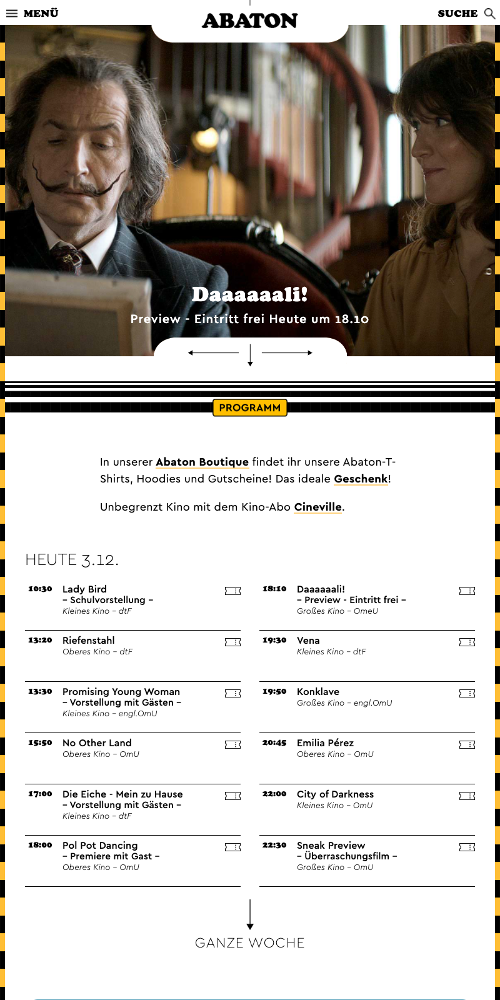
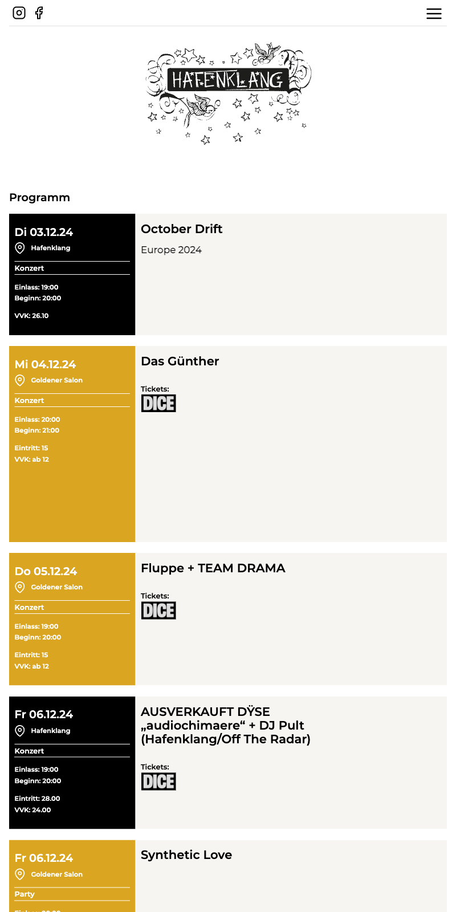
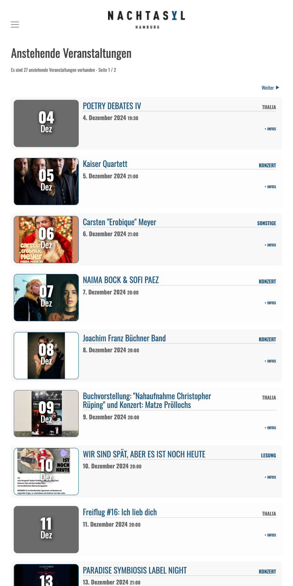

# Hamburg Events

## Favorite spots

### Knust Hamburg

- [Google Maps Location](https://maps.app.goo.gl/GHPBHArVxUsCCe3x9)

  
More Information

  
  **Address:** Neuer Kamp 30, 20357, Hamburg  
  **Website:** [https://knusthamburg.de/](https://knusthamburg.de/)  
  **Email:** [info@knusthamburg.de](mailto:info@knusthamburg.de)  
  **Phone:** +494087976230  

  **Background:**  
  Knust Hamburg is a renowned music club located in the Rinderschlachthalle at Neuer Kamp 30 in St. Pauli, Hamburg. Established in 1976, the club has a rich history, having initially operated in the basement of a building on Brandstwiete in the Altstadt before moving to its current location in 2003.

  **Evolution and Expansion:**  
  Over the years, Knust Hamburg has undergone significant transformations. From its humble beginnings as a small underground club, it has grown to become a prominent live music venue, hosting a diverse range of acts, including jazz, rock, and indie music. The club’s capacity has increased to accommodate around 500 guests, making it an ideal spot for intimate concerts and events.

  **Program and Events:**  
  Knust Hamburg offers a varied program, featuring both local and international artists. The club regularly hosts live concerts, as well as special events like football match screenings and themed parties. Some notable acts that have performed at the club include BOY, Gaby Young, Friska Vijor, and We Are Scientists.

  **Unique Features:**  
  The club’s unique atmosphere and setting, nestled in the former slaughterhouse, contribute to its charm. Patrons can enjoy the club’s “Knust-Wurst” and other small bites while taking in the lively music scene. The Lattenplatz, a charming outdoor area, becomes a hub for summer events and live concerts, attracting the local community and visitors alike.

  **Legacy and Recognition:**  
  Knust Hamburg has been recognized for its contributions to Hamburg’s music scene, and its history has been documented in various publications, including books and online resources. The club’s legacy continues to thrive, making it a must-visit destination for music enthusiasts and locals alike.
  

### Zwick St. Pauli

- [Google Maps Location](https://maps.app.goo.gl/GHPBHArVxUsCCe3x9)

  
More Information

  
  **Address:** Millerntorplatz 1, 20359, Hamburg  
  **Website:** [https://www.zwick4u.com](https://www.zwick4u.com/zwick-st-pauli-de-14.html)  
  **Phone:** +49403141900  

  **Overview:**  
  Zwick St. Pauli is a popular music and sports bar with a classic rock vibe and an atmosphere filled with music memorabilia. Visitors enjoy live sports broadcasts, regular music events, and a wide selection of food and drinks.

  **Opening Hours:**  
  Daily from 11:30 AM to late

### Nochtspeicher

- [Google Maps Location](https://maps.app.goo.gl/tx6ktNHNEYL9oUk86)

  
More Information

  
  **Address:** Bernhard-Nocht-Str. 69a, 20359, Hamburg  
  **Website:** [https://nochtspeicher.de/](https://nochtspeicher.de/)  
  **Email:** [info@nochtspeicher.de](mailto:info@nochtspeicher.de)  
  **Phone:** +494033398869  

  **Background:**  
  The Nochtspeicher is a unique attraction in Hamburg, located at Bernhard-Nocht-Str. 69a, 20359 Hamburg. This former Erotic-Art-Museum has been transformed into a vibrant cultural center, hosting events, concerts, literature, dance, and art exhibitions.

  **Summary of Products and Services:**  

- Event space for various cultural activities, including concerts, poetry slams, and performances  
- No specific products are offered; instead, it’s a venue for experiencing art, music, and literature

  **Reviews and Ratings:**  
  Based on TripAdvisor reviews, the Nochtspeicher has an average rating of 4.5/5, with reviewers praising its central location, comfortable seating, and friendly staff. Some cons mentioned include limited food and drink options. Overall, visitors appreciate the unique atmosphere and successful events hosted at the Nochtspeicher.

  **Additional Information:**  

- **Coordinates:** 53.54716, 9.96128  
- **Category:** Attraction  
- **Note:** The provided information focuses on the Nochtspeicher’s cultural activities and events, omitting details about its history as an Erotic-Art-Museum.
  

### Molotow Club

- [Google Maps Location](https://maps.app.goo.gl/wz51JqvVxKSQVBZE6)

  
More Information

  
  **Address:** Nobistor 14, Hamburg, DE  
  **Website:** [https://molotowclub.com/](https://molotowclub.com/)  
  **Email:** [molotow@molotowclub.com](mailto:molotow@molotowclub.com)  
  **Phone:** +4940310845  

  **Background:**  
  The Molotow Club is a legendary live music venue and club located in Hamburg, Germany. With a rich history spanning over three decades, it has been a staple of the city’s music scene, hosting a wide range of genres including rock, indie, and electronic music.

  **Current Location:**  
  The club is currently situated at Nobistor 14, Hamburg, DE, with a total capacity of up to 530 people across its three rooms: the Club, SkyBar, and Karatekeller.

  **History:**  
  The Molotow Club was founded in 1990 and initially located in the Esso-Häuser on Spielbudenplatz. After being evicted in 2013, the club underwent several relocations before finding its current home at Nobistor 14 in 2014.

  **Notable Events:**  
  The club has hosted numerous notable acts, including successful bands like Die Toten Hosen, and has been a launching pad for many up-and-coming artists. Its parties, such as MOTORBOOTY - The Rock’n’Roll Dancefloor, have become legendary.

  **Additional Information:**  

- **Future Outlook:** The club’s future is currently secure, with a recent agreement allowing it to remain at its current location until the end of 2024. Efforts are being made to preserve the club culture in Hamburg, and the Molotow Club is set to continue playing a vital role in the city’s music scene.
  

### Spielbudenplatz Events

- [Google Maps Location](https://maps.app.goo.gl/ViFxduZSsYEVDgVT8)

  
More Information

  
  **Address:** Spielbudenplatz 21-22, Hamburg, DE  
  **Website:** [https://spielbudenplatz.eu/](https://spielbudenplatz.eu/)
  **Email:** <info@spielbudenplatz.eu>
  **Phone:** +494035771050

  **Events and Activities:**
  
- **Grenzen sind relativ Festival:**  
    On Saturday, August 17, 2024, from 15:00 to 23:00, the Spielbudenplatz will host a festival with a diverse program featuring live music, interactive experiences, and networking opportunities.
  
- **Food Truck Festival:**  
    Although no specific dates are mentioned, previous years’ events suggest that the Food Truck Festival might take place around May, with over 20 food trucks offering a wide range of international cuisine, including vegan options.
  
- **Live Music and Container Bars:**  
    Throughout the summer, enjoy live music and refreshing drinks at the container bars on the Spielbudenplatz, perfect for a leisurely summer evening.
  
- **Sun:Sets:**  
    Every Friday, the Spielbudenplatz’s summer deck transforms into a sundowner hotspot, ideal for relaxing and taking in the atmosphere.

  **Note:**  
  These events are subject to change and might not be comprehensive, as the search results only provide a snapshot of past and upcoming events. For the most up-to-date information, it’s recommended to check with the Spielbudenplatz’s official website or social media channels.

### Cinemaxx Hamburg Dammtor - Top Kinofilme

- [Google Maps Location](https://maps.app.goo.gl/u8tYQxdPe5rwBJnd6)

  
More Information

  
  **Address:** Dammtordamm 1, 20354 Hamburg  
  **Website:** [https://www.cinemaxx.de/hamburg-dammtor](https://www.cinemaxx.de/hamburg-dammtor)  
  **Email:** [Webmaster@CinemaxX.com](mailto:Webmaster@CinemaxX.com)  
  **Phone:** +494080806969  

  **Background:**  
  Located directly at Hamburg’s Dammtor train station, Cinemaxx Hamburg Dammtor is easily accessible by public transportation (S-Bahn and U-Bahn) or on foot. The cinema offers eight screens with a diverse program, ensuring a full and varied film schedule.

  **Ticket Prices:**  
  Ticket prices vary depending on the day of the week:  

- Monday to Wednesday: €7.90  
- Thursday to Sunday: €9.90

  **Reviews:**  
  According to customer reviews, Cinemaxx Hamburg Dammtor has an overall rating of [insert rating here].

  **Unique Features:**  
  The cinema is designed as a “Filmfestspielhaus” (film festival house) and offers a unique cinematic experience. Tickets can only be booked directly through the cinema.

  **Parking:**  
  Parking options are available on the opposite side of the train tracks, including Alsterterasse, Edm.-Siemers-Allee, and Neue Rabenstraße/Mittelweg.

### Schanzenkino - Open-Air

- [Google Maps Location](https://maps.app.goo.gl/VCvFtKB19FuhDUbFA)

  
More Information

  
  **Address:** Sternschanze 1, Hamburg, DE  
  **Website:** [https://schanzenkino.de/kino/tree/node2871/city197](https://schanzenkino.de/kino/tree/node2871/city197)  
  **Email:** [Not Available]  
  **Phone:** +494915206484651  

  **Background:**  
  Located in Hamburg, Germany, Schanzenkino Open-Air is an outdoor cinema (Open-Air-Kino) situated in the Schanzenpark. It offers a unique film experience under the stars, with a large screen and digital projection technology.

  **Film Screenings:**  
  The cinema screens a daily program of 88 film showings, featuring the latest movies, film culture, and exclusive events.

  **Ambiance:**  
  The open-air setting provides a magical atmosphere, with a twinkling starry sky as the backdrop.

  **Ratings and Reviews:**  
  Based on 21 reviews, Schanzenkino Open-Air has a rating of 3.3 out of 5.0, with reviewers praising the unique outdoor setting and good film selection. Some reviewers noted that the seating could be improved.

  **Summary:**  
  Schanzenkino Open-Air is a charming outdoor cinema in Hamburg, offering a range of films and events under the stars. While it has some room for improvement, it remains a popular destination for film enthusiasts and those seeking a unique entertainment experience.

### Abaton Kino

- [Google Maps Location](https://maps.app.goo.gl/4LxRddCXAYnwajsk9)

  
More Information

  
  **Address:** Allende-Platz 3, Hamburg (Grindel, Rotherbaum)  
  **Website:** [https://www.abaton.de](https://www.abaton.de)  
  **Email:** [Not Available]  
  **Phone:** +494041320320  
  **Distance from City Center:** 1.66 km  

  **About:**  
  Abaton Kino Hamburg is a cinema located in the heart of Hamburg’s Grindel neighborhood. The cinema offers a wide range of films, including new releases and classic movies. The building has a rich history, dating back to 1969 when it was established as one of Germany’s first program cinemas.

  **Bistro:**  
  The Abaton Bistro is located on site, offering a cozy atmosphere and a menu of simple, yet delicious food. The bistro is popular among students, film enthusiasts, and locals alike. In the summer, the outdoor seating area on Allende-Platz is a lovely spot to enjoy a meal or snack.

  **Ticket Information:**  
  You can purchase tickets online or at the cinema box office. The cinema offers a variety of ticket options, including advance bookings and special deals for students and seniors.

  **Program:**  
  Check the Abaton Kino Hamburg website for the latest film program, showtimes, and prices. The cinema also offers a loyalty program and gift vouchers for private events and parties.

### Ponybar Programm

- [Google Maps Location](https://maps.app.goo.gl/VJVVarSpRMMey16K6)

  
More Information

  
  **Address:** Allende-Platz 1, 20146 Hamburg, Germany  
  **Coordinates:** 53.567497, 9.982314  
  **Phone:** +4940428387895  
  **Opening Hours:**  

- Monday: 09:00 - 02:00  
- Sunday: 10:00 - 23:00  
- Other days: 09:00 - 02:00  

  **Description:**  
  Pony Bar is a cultural hub and café by day, transforming into a cozy bar by night. It offers a rich cultural program, including jazz events, and is a popular spot for students and locals alike.

  **Online Presence:**  

- **Website:** [ponybar.de](https://www.ponybar.de) (German only)  
- **Instagram:** [@pony_bar](https://www.instagram.com/pony_bar) (2,974 followers) - showcasing the café’s transformation into a cultural hub at night

  **Reviews:**  
  Pony Bar has been praised for its high-quality events, affordable prices, and welcoming atmosphere.

  **Gutschein (Vouchers):**  
  Pony Bar occasionally offers vouchers, which can be redeemed for various events and services. Keep an eye on their social media or website for announcements.

  **Note:**  
  The information provided is based on search results and might be subject to change. It is recommended to verify the details with Pony Bar directly or through their official website.

### Übel & Gefährlich

- [Google Maps Location](https://maps.app.goo.gl/LpJxnH2pXXhgWHEu5)

  
More Information

  
  **Address:** Feldstr. 66, 20359 Hamburg, Germany  
  **Website:** [uebelundgefaehrlich.com](https://uebelundgefaehrlich.com/)  
  **Email:** [info@uebelundgefaehrlich.com](mailto:info@uebelundgefaehrlich.com)  
  **Phone:** +494015738276469  

  **About:**  
  Übel & Gefährlich is a Hamburg-based nightclub located in the Flakturm IV bunker on Heiligengeistfeld. Established in 2006, the club is known for its diverse programming, ranging from techno and jazz to singer-songwriter concerts. The venue has hosted notable artists such as Xavier Rudd, Kettcar, Polarkreis 18, Scooter, and Billie Eilish.

  **History:**  
  The bunker was initially opened as the J’s club in 1999, but it went bankrupt in 2001. In 2006, Tino Hanekamp and others reopened the space as Übel & Gefährlich. The club has since become a staple of Hamburg’s nightlife, earning numerous awards, including the “Best Music Club of the Year” title at the Hamburger Club Award in 2011, 2015, and 2019.

  **Features:**  
  The club is divided into two areas: the large ballroom and the smaller Turmzimmer. It can accommodate around 1000 guests and features a rooftop terrace with a panoramic view of the city. Although the rooftop area was closed in 2021 due to renovations, the club continues to offer an immersive experience with its unique bunker setting.

  **Awards and Recognition:**  
  Übel & Gefährlich has received praise for its commitment to fostering a vibrant club culture. In 2023, the clubkombinat Hamburg e.V. honored Übel & Gefährlich with the “Best Initiative ‘Zukunft feiern’” award, recognizing its efforts to promote sustainable and future-oriented club culture.

  **Reviews:**  
  Visitors have praised the club’s cleanliness, reasonable drink prices, and top-notch sound system. However, some have noted issues with long wait times at the entrance and bars. Overall, Übel & Gefährlich is a popular destination for music enthusiasts and partygoers alike, offering a unique and memorable experience in the heart of Hamburg.

### Hafenklang

- [Google Maps Location](https://maps.app.goo.gl/659rbpxjywD1EW5bA)

  
More Information

  
  **Address:** Große Elbstraße 84, Hamburg, DE  
  **Website:** [hafenklang.com](https://hafenklang.com/)  
  **Email:** [kontakt@hafenklang.com](mailto:kontakt@hafenklang.com)  
  **Phone:** +4940388744  

  **Rating:** 4.3 out of 5 stars based on 34 reviews, with the best rating being 5.0

  **Summary of Reviews and Ratings:**  
  Reviews praise Hafenklang for its cozy atmosphere, friendly staff, and diverse selection of drinks. Some reviewers mention that the bar can get crowded, but overall, it’s a popular spot for socializing.

  **Upcoming Events:**  
  Hafenklang is hosting the “Get Lost Fest 10” on Friday, August 30th, and Saturday, August 31st.

  **Note:**  
  This information focuses solely on Hafenklang Hamburg, ignoring any irrelevant details.

### Nachtasyl  

 - [Google Maps Location](https://maps.app.goo.gl/uoH3ybTg1PnAeRC59)  

  
   
More Information
  

   **Address:** Alstertor 1, 20095 Hamburg, DE  

   **Website:** [nachtasyl.de](http://nachtasyl.de/)  

   **Email:** N/A  

   **Phone:** +494032814207  

   **Rating:** 5.0 out of 5 stars on Tripadvisor  

   **Summary of Reviews and Ratings:**  
   Visitors praise Nachtasyl for its great location, good music, and friendly atmosphere. Some reviewers mention that the bar is small and not suitable for large groups, but overall, it’s an excellent place to spend an evening in Hamburg.  

   **Overview:**  
   Nachtasyl is an attractive venue for those looking for a diverse night out in Hamburg. Offering a mix of concerts, readings, and club events, it provides various options for entertainment and relaxation.  

