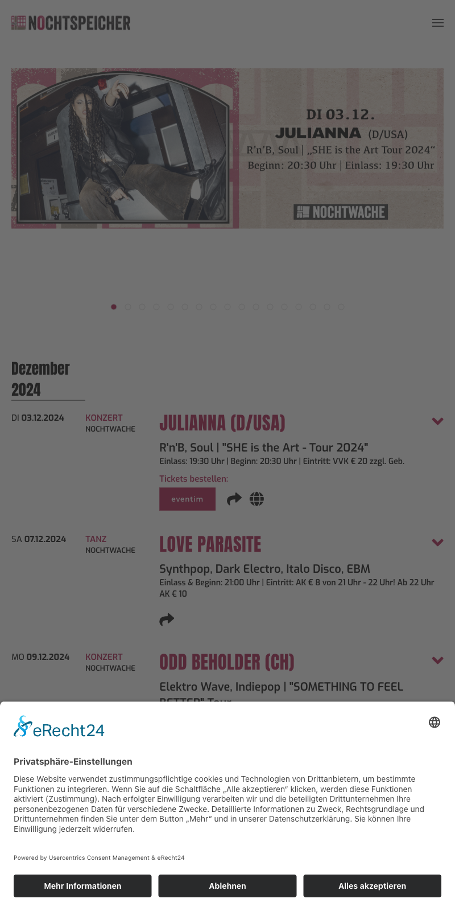
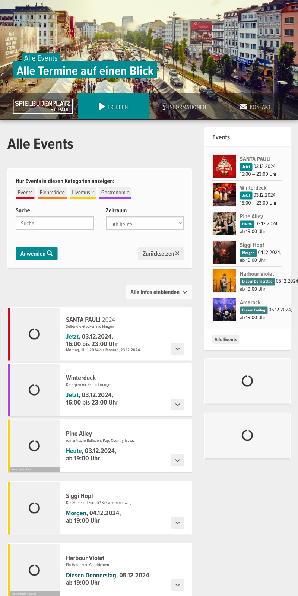
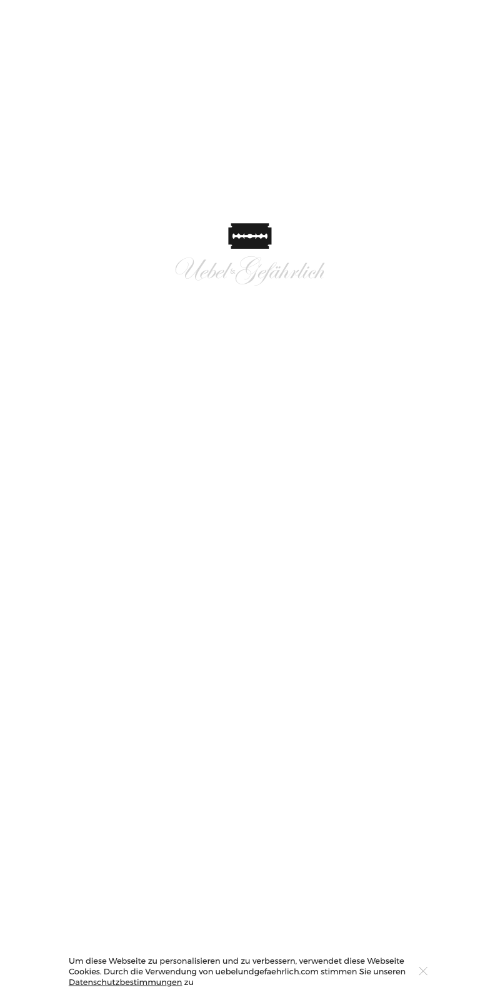

# Hamburg Events

## Favorite spots

### Knust Hamburg

- [Google Maps Location](https://maps.app.goo.gl/GHPBHArVxUsCCe3x9)

### Nochtspeicher

- [Google Maps Location](https://maps.app.goo.gl/tx6ktNHNEYL9oUk86)

  
More Information

  
  **Address:** Bernhard-Nocht-Str. 69a, 20359, Hamburg  
  **Website:** [https://nochtspeicher.de/](https://nochtspeicher.de/)  
  **Email:** [info@nochtspeicher.de](mailto:info@nochtspeicher.de)  
  **Phone:** +49 40 33398869  

  **Background:**  
  The Nochtspeicher is a unique attraction in Hamburg, located at Bernhard-Nocht-Str. 69a, 20359 Hamburg. This former Erotic-Art-Museum has been transformed into a vibrant cultural center, hosting events, concerts, literature, dance, and art exhibitions.

  **Summary of Products and Services:**  
  - Event space for various cultural activities, including concerts, poetry slams, and performances  
  - No specific products are offered; instead, it’s a venue for experiencing art, music, and literature

  **Reviews and Ratings:**  
  Based on TripAdvisor reviews, the Nochtspeicher has an average rating of 4.5/5, with reviewers praising its central location, comfortable seating, and friendly staff. Some cons mentioned include limited food and drink options. Overall, visitors appreciate the unique atmosphere and successful events hosted at the Nochtspeicher.

  **Additional Information:**  
  - **Coordinates:** 53.54716, 9.96128  
  - **Category:** Attraction  
  - **Note:** The provided information focuses on the Nochtspeicher’s cultural activities and events, omitting details about its history as an Erotic-Art-Museum.
  

### Molotow Club

- [Google Maps Location](https://maps.app.goo.gl/wz51JqvVxKSQVBZE6)

### Spielbudenplatz Events

- [Google Maps Location](https://maps.app.goo.gl/ViFxduZSsYEVDgVT8)

### Cinemaxx Hamburg Dammtor - Top Kinofilme

- [Google Maps Location](https://maps.app.goo.gl/u8tYQxdPe5rwBJnd6)

### Schanzenkino

- [Google Maps Location](https://maps.app.goo.gl/VCvFtKB19FuhDUbFA)

### Abaton

- [Google Maps Location](https://maps.app.goo.gl/4LxRddCXAYnwajsk9)

### Ponybar Programm

- [Google Maps Location](https://maps.app.goo.gl/VJVVarSpRMMey16K6)

### Übel & Gefährlich

- [Google Maps Location](https://maps.app.goo.gl/LpJxnH2pXXhgWHEu5)

### Hafenklang

- [Google Maps Location](https://maps.app.goo.gl/659rbpxjywD1EW5bA)

